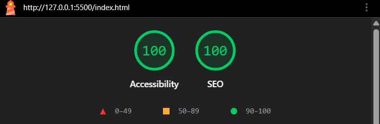
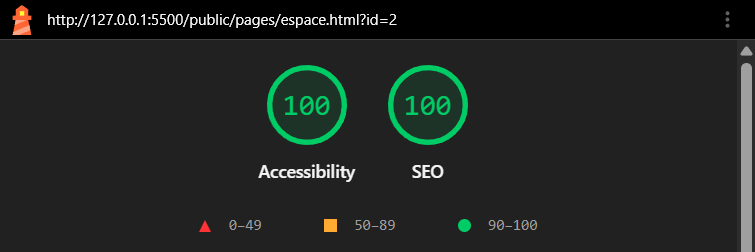
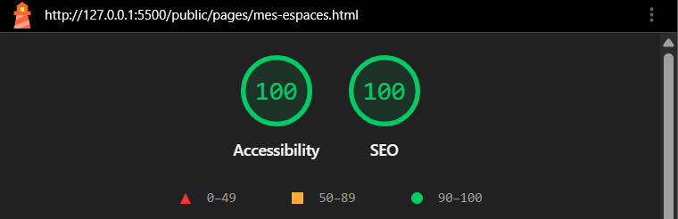
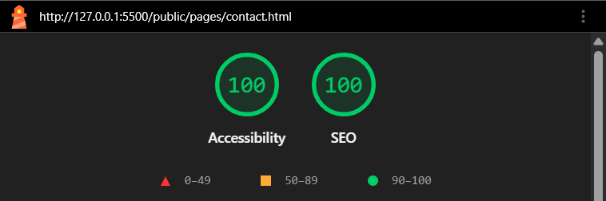

# ProSpace Solutions

Projet Front-End réalisé pour mon examen final de Développeur Web Full-Stack.

Le but était de reproduire un site de location d'espaces professionnels à partir d'une maquette, uniquement avec HTML, SCSS et JavaScript natif.

Le site permet de chercher des espaces, consulter leurs informations, les enregistrer dans une sélection et contacter l'équipe.

# Fonctionnalités

Le projet contient 4 pages :

- une page d'accueil avec les différents espaces disponibles et plusieurs filtres
- une page de détail pour chaque espace
- une page "Mes Espaces" pour retrouver les favoris
- une page Contact avec un formulaire et un carrousel pour l'équipe

Les informations des espaces sont stockées dans un fichier JSON puis récupérées en JavaScript avec fetch().

Pour les favoris, j'ai utilisé localStorage pour qu'ils restent enregistrés même après avoir fermé le navigateur.

# Fiche d'un espace

Je n'ai pas créé une page HTML différente pour chaque espace.

Quand on clique sur une fiche, l'id de l'espace est ajouté dans l'URL :

espace.html?id=1

Je récupère ensuite cet id avec URLSearchParams et je cherche dans le fichier JSON quel espace correspond.

Les informations de la page sont ensuite ajoutées en JavaScript.

# Organisation du projet

J'ai séparé le SCSS en plusieurs fichiers pour éviter d'avoir un seul gros fichier difficile à retrouver.

J'ai donc séparé les variables, les couleurs, les mixins, les composants, le header et le footer ainsi que les styles propres à chaque page.

J'ai également fait un fichier JavaScript différent pour chaque page qui en avait besoin.

# Technologies utilisées

- HTML5
- SCSS
- JavaScript natif
- JSON
- localStorage
- fetch
- async / await
- URLSearchParams

# Responsive

Le site fonctionne sur ordinateur, tablette et mobile.

J'ai ajouté plusieurs media queries pour modifier la disposition des éléments selon la taille de l'écran.

J'ai surtout dû adapter les cartes, le header, le footer, les filtres, la galerie de la fiche espace, le formulaire et le carrousel.

# SEO

Chaque page possède un title et une meta description.

Pour la fiche espace, le titre et la description sont modifiés en JavaScript selon l'espace qui est affiché.

J'ai également renommé les images avec des noms plus compréhensibles et utilisé loading="lazy" sur certaines images.

# Accessibilité

Le sujet demandait de faire attention à l'accessibilité, j'ai donc essayé de la prendre en compte pendant le développement et pas uniquement à la fin.

J'ai notamment vérifié :

- la navigation complète au clavier
- le focus sur les éléments interactifs
- les textes alternatifs des images
- les icônes décoratives
- les attributs ARIA quand ils étaient nécessaires
- les messages d'erreur du formulaire
- le carrousel au clavier
- les contrastes
- le zoom navigateur à 200 %
- un test avec le Narrateur Windows

Les tarifs de la fiche espace ont également été placés dans un tableau HTML pour avoir une structure plus adaptée aux lecteurs d'écran.

J'ai terminé par des tests Lighthouse en mode mobile sur les 4 pages.

Résultats obtenus :

- Accessibilité : 100
- SEO : 100

# Captures Lighthouse

# Formulaire de contact

Le formulaire est vérifié en JavaScript.

Les champs obligatoires affichent un message d'erreur quand ils ne sont pas correctement remplis.

Comme le projet est uniquement en Front-End, les données ne sont pas réellement envoyées à un serveur. Un message de confirmation est simplement affiché quand le formulaire est valide.

# Lancer le projet

J'ai utilisé Live Server dans VS Code pour lancer le projet, notamment parce que fetch() doit récupérer le fichier JSON.

Pour compiler le SCSS :

sass public/assets/scss/styles.scss public/assets/css/styles.css

